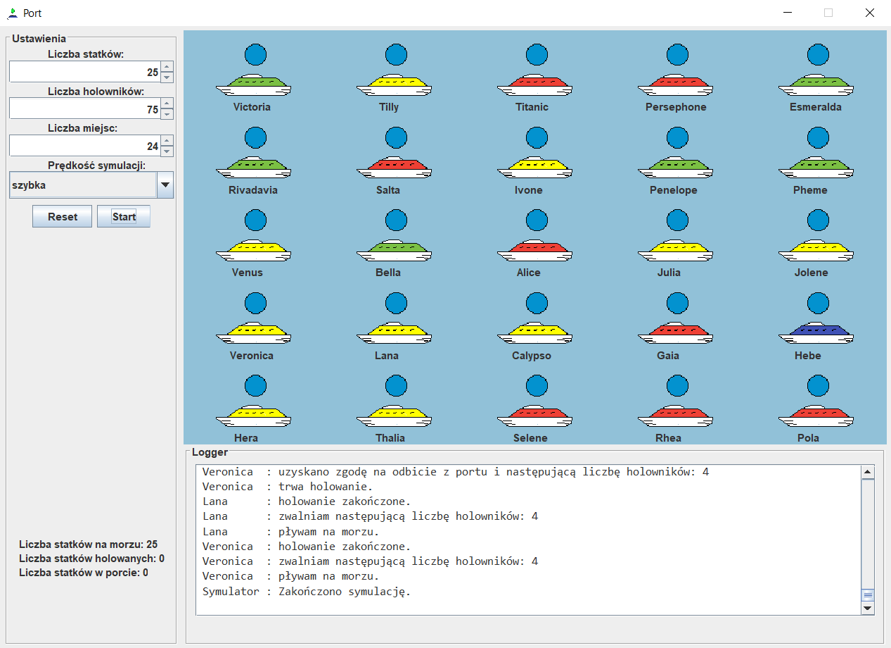

# Multi Threaded Ship Port Simulator

## General info
This project is an effect of concurrent programming training - each ship represents separate thread. Ships are trying to moor to the Port and then spend there some time. After a random amount of time for ship has passed, it departs and spends time on sea. This process repeats specified amount of iterations. There is limited amount of quays and tugs. Each ship uses specified amount of tugs to dock and depart from Port. 

## Simulation assumptions
- there are n ships available (0 < n <= 25)
- there are m quays available (0 < m < n)
- each ship requires k tugs (0 < k < 5)
- the sum of tugs available at port is lesser than tugs required for all ships to dock at once

Values above can be freely modified via graphical interface written in Swing. Below is a demonstration of GUI of a program.

## Additional info

### Ship
- Has a randomly generated (in range k) number of tugs required
- Each number has a color representation which is assigned to a ship:
    - blue - 1 tug 
    - red - 2 tugs
    - green - 3 tugs
    - yellow - 4 tugs
- Each ship has a unique name
- There are 3 states the ship can be in, which are signaled during simulation, above each ship, with colors:
    - on sea - signalized with blue color 
    - tugged - signalized with yellow color
    - docked - signalized with green color
- Ship has 3 simulation modes which change the time the ship spends on sea/in the port and count of iterations: the more time the lesser iterations.
